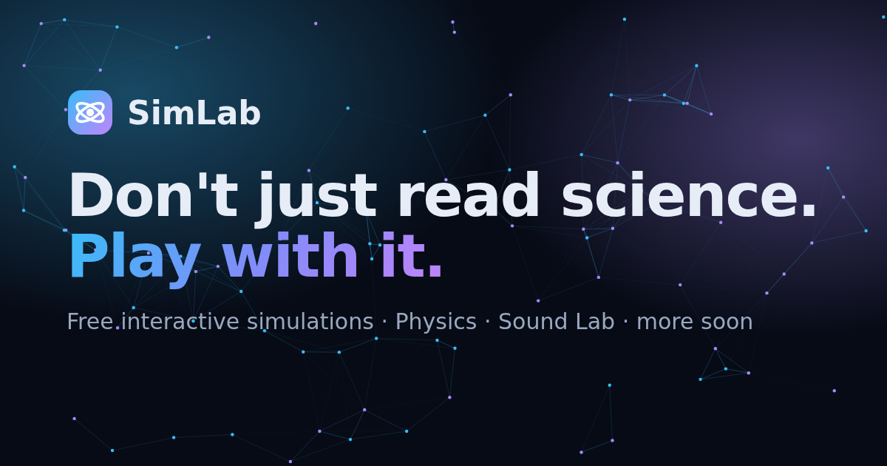

# SimLab — interactive science simulations

> **Don't just read science. Play with it.**

**Live site: https://i2003-byte.github.io/**

[](https://i2003-byte.github.io/)

SimLab is a free collection of interactive science simulations for school students (starting with Class 7). Every simulation runs in the browser on a phone, tablet or computer, with no sign-up and no install. Students move sliders, press play, watch live graphs and hear real sounds, then open the **Learn** panel for the concept, key formulas, real-world examples and challenge questions.

## What's inside

**92 live simulations** in Physics, Chemistry, Geography, Economics and Computer Science. Mathematics, Biology and Astronomy are coming soon.

| Topic | Simulations |
|---|---|
| ⚙️ **Mechanics** (30) | Projectile Motion · Simple Pendulum · Speed Race: Distance ÷ Time · Distance–Time Graph Builder · Pendulum Clock Lab · Pressure = Force ÷ Area · Balanced and Unbalanced Forces · Pressure in Liquids · Friction on Different Surfaces · Rolling vs Sliding Friction · Ball Bearings and Lubricants · Distance and Displacement · Velocity–Time Graph: Area = Distance · Uniform Circular Motion · Inertia: Coin on a Card · Newton's Second Law: F = ma Cart Lab · Action and Reaction: Balloon Rocket · Collisions and Momentum · Universal Law of Gravitation · Free Fall and g on Different Worlds · Buoyancy and Archimedes' Principle · Work Done: W = F s cos θ · Roller Coaster: Potential and Kinetic Energy · Power Race: Same Work, Different Time · Spring–Mass Oscillator · SHM and Uniform Circular Motion · Forced Oscillations and Resonance · Planetary Orbits and Kepler's Laws · Escape Velocity Launcher · Satellites and Geostationary Orbit |
| 🌊 **Waves** (5, Class 11 and 12) | Transverse and Longitudinal Waves · Standing Waves on a String · Beats · Doppler Effect · Wave Interference: Two Sources in a Ripple Tank |
| 🔊 **Sound Lab** (14, Class 7) | Vibrating Objects · Sound Through Solids, Liquids & Gases · Bell Jar: Sound in a Vacuum · Amplitude & Loudness · Frequency & Pitch · Oscillation Counter · Voice Box (Larynx) · Inside the Ear · Who Can Hear It? · Music or Noise? · City Decibel Meter · Quiet the Neighbourhood · Water Glass Xylophone · Guitar String |
| 🔥 **Heat** (6, Class 7) | Hot and Cold: Temperature · Clinical vs Laboratory Thermometer · Conduction: Heat Through a Rod · Convection Currents in Water · Radiation: Black vs Shiny · Sea and Land Breezes |
| ⚡ **Electricity** (15, Class 7, 8, 10 and 12) | Electric Circuits and Symbols · Heating Effect and the Fuse · Make an Electromagnet · Charging by Rubbing · Gold-Leaf Electroscope · Lightning and the Lightning Conductor · Ohm's Law and Resistivity · Resistors in Series and Parallel · Electric Power and the Electricity Bill · Magnetic Field Lines: Magnets and a Wire · Magnetic Field of a Loop and a Solenoid · Electric Motor and Generator · Coulomb's Law: Force Between Charges · Electric Fields: Field Lines and Equipotentials · Electric Dipole in a Uniform Field |
| 💡 **Light** (11, Class 7, 10 and 12) | Pinhole Camera · Plane Mirror and Lateral Inversion · Newton's Colour Disc · Spherical Mirrors: Ray Diagrams · Refraction through a Glass Slab · Convex and Concave Lenses: Ray Diagrams · Human Eye: Power of Accommodation · Myopia and Hypermetropia: Correcting Vision · Dispersion by a Prism and the Blue Sky · Young's Double-Slit Experiment: Interference Fringes · Single-Slit Diffraction: Light Spreading Through a Slit |
| ⚗️ **Chemistry: Acids, bases and salts** (2, Class 7) | Natural Indicators: Litmus, Turmeric and China Rose · Neutralisation: Acid Meets Base |
| 🌏 **Geography: Earth's motions** (3, Class 7) | Day, Night and Sunrise Across India · Revolution and the Seasons · Time Zones: IST and World Clocks |
| 📈 **Economics: Demand and supply** (3, Class 11–12) | The Demand Curve · Supply and Market Equilibrium · Price Ceiling and Price Floor |
| 💻 **Computer Science: Numbers and logic** (3, Class 11) | Binary Counter and Place Values · Logic Gates and Truth Tables · Sorting Race: Bubble, Selection and Merge |

## Features
- **Hands-on:** sliders, play/pause/step, speed control, live readouts and graphs
- **Made for phones:** each simulation opens like an app, with the picture and its key numbers pinned at the top, tabs for Controls · Numbers · Graph · Try this, a big start button, and − / + buttons on every slider. On the home page, pick a simulation from the Tap & play row (it opens already running) or by class
- **For classrooms:**
  - Filter simulations by class (7–12), topic or level
  - Fullscreen mode
  - **Share link** saves every setting in the URL, so a whole class can open the same experiment
- **See and hear it:** sound simulations generate real tones. Sound is off until you switch it on.
- **Works everywhere:** phone and desktop layouts, light and dark themes, keyboard shortcuts, screen-reader labels and reduced-motion support
- **Fast and simple:**
  - Plain HTML, CSS and JavaScript
  - No frameworks, no build step, no tracking
  - Hosted free on GitHub Pages

## Suggest a simulation or report a problem
Open an [issue](https://github.com/i2003-byte/i2003-byte.github.io/issues/new/choose) and pick **Simulation idea** or **Bug or science error**.

## How this project is maintained
The site is built and maintained with AI coding agents (Claude Code), guided by the files in this repository:
- `AGENTS.md`: rules and a map for agents
- `.claude/skills/`: step-by-step recipes
- `tools/check.mjs`: automated checks that run before every change goes live

See **Maintaining with AI** below.

---

## Folder structure

```
/
├── index.html              Landing page (hero, Tap & play, class chips, search, subjects, recent…)
├── about.html              About page
├── 404.html                Friendly "not found" page (GitHub Pages serves it automatically)
├── .nojekyll               Tells GitHub Pages to serve files as-is (needed for /_template/)
├── README.md               This file (for humans)
├── AGENTS.md               Instructions for AI coding agents (open standard, agents.md)
├── CLAUDE.md               Claude Code entry point → imports AGENTS.md
├── llms.txt                Site summary for AI tools (open standard, llmstxt.org) — GENERATED
├── sitemap.xml, robots.txt For search engines — GENERATED
├── .editorconfig           Formatting rules for any editor
│
├── tools/
│   ├── check.mjs           Validates everything + regenerates the GENERATED files (no dependencies)
│   └── browser-test.mjs    Optional real-browser test at phone & desktop sizes (uses Playwright)
├── .claude/
│   ├── settings.json       Hook: runs tools/check.mjs before every `git push` and blocks bad pushes
│   └── skills/add-simulation/SKILL.md   Step-by-step recipe an AI follows to add a simulation
├── .github/
│   ├── workflows/check.yml Runs tools/check.mjs on GitHub for every push (✓ or ✗ on each commit)
│   └── ISSUE_TEMPLATE/     Forms for "Simulation idea" and "Bug or science error"
│
├── assets/
│   ├── css/style.css       ALL styles. Theme tokens (colours, fonts, spacing…) live at the top
│   ├── js/catalog.js       ★ The single data file: site settings, subjects, simulations
│   ├── js/nav.js           Shared header, mega-menu, mobile drawer, search, breadcrumbs, footer
│   ├── js/main.js          Landing-page logic (hero particles, Tap & play row, class chips…)
│   ├── js/subject.js       Renders subject pages and /simulations/ from the catalog
│   ├── js/common.js        Simulation toolkit: loop, sliders, graph, audio, URL state, fullscreen…
│   └── img/                favicon, social preview image, thumbnails (thumbs/*.svg)
│
├── physics/
│   ├── index.html          Subject page (tiny template, reads data-subject="physics")
│   ├── projectile/         index.html (page + Learn text) and sim.js (the simulation)
│   ├── pendulum/
│   └── …14 Sound Lab folders
├── chemistry/ mathematics/ biology/ astronomy/   Subject pages (coming soon)
├── simulations/index.html  "All Simulations" page (same template, data-subject="all")
│
└── _template/              Blank simulation starter: copy it to create a new simulation
    ├── index.html
    └── sim.js
```

**Paths are root-relative** (`/assets/css/style.css`), so links work from any folder. The site must be served from the domain root, which is what a `username.github.io` repository does.

---

## How to add a new simulation (step by step)

1. **Copy the template folder.**
   Copy `/_template/` to `/<subject>/<sim-id>/`, for example `/physics/spring-mass/`.
   Use lowercase letters and dashes for the id.

2. **Edit `index.html` in the new folder.**
   - Change `<body data-sim="template" …>` to `<body data-page="sim" data-sim="spring-mass">`, and delete the `data-title` / `data-description` attributes.
   - Update `<title>`, the meta description, and the `canonical` / `og:url` paths.
   - Rewrite the **Learn** section: big idea, formulas, examples, "Try this" questions.

3. **Write the simulation in `sim.js`.** The template is a fully commented bouncing ball. The shape is:

   ```js
   SimLab.createSim({
     params:   [{ id: 'k', label: 'Spring constant', min: 1, max: 100, step: 1, value: 20, unit: 'N/m' }],
     readouts: [{ id: 'x', label: 'Displacement', unit: 'm' }],
     graph:    { title: 'x vs time', yLabel: 'm', series: [{ label: 'x' }], window: 10 },
     reset(sim)      { sim.state = { x: 0.2, v: 0 }; },          // start state from sim.p
     update(sim, dt) { /* advance physics by dt seconds */ },
     draw(sim)       { /* paint with sim.ctx, sim.width, sim.height, sim.colors */ },
     readout(sim)    { return { x: sim.state.x }; },
     sample(sim)     { return [sim.state.x]; }                    // values for the graph
   });
   ```

   `createSim` builds everything else for you:
   - title, badges and breadcrumbs
   - Play/Pause, Step, Reset and speed buttons
   - sliders with live values, presets, dropdowns and toggles
   - readouts and the live graph
   - fullscreen, "Copy share link" and "Reset to defaults"
   - keyboard shortcuts (Space, R, →)
   - touch and mouse input
   - previous/next links and related simulations

   Other options:
   - `audio: true` adds a Sound on/off button. Use it with `SimLab.audio.tone()`, `voice()` or `noise()`.
   - `transport: false` hides Play/Pause for activities that don't need time.
   - `buttons: [...]` adds action buttons.
   - `pointer: { down, move, up }` handles drag interactions.
   - `onParam` keeps the simulation running while a slider moves, instead of restarting it.
   - `mobileAspect: '3 / 4'` gives the canvas a taller shape on phones.

   Helpers are available too: `SimLab.math` (clamp, rk4, fmt…), `SimLab.vec`, and `SimLab.draw` (arrow, text, grid, curve…).

4. **Add a thumbnail** (optional): `assets/img/thumbs/<sim-id>.svg`, 320×200. If you skip this, the default thumbnail is used.

5. **Add ONE entry to `SIMULATIONS` in `assets/js/catalog.js`.** Copy an existing entry and edit it:

   ```js
   {
     id: 'spring-mass', subject: 'physics', branch: 'mechanics',
     title: 'Spring–Mass Oscillator',
     description: "Stretch a spring and explore Hooke's law.",
     level: 'Beginner', tags: ['hooke', 'spring', 'oscillation'],
     thumbnail: '/assets/img/thumbs/spring-mass.svg',
     link: '/physics/spring-mass/',
     status: 'live',            // 'coming-soon' shows it greyed out, not clickable
     featured: false,           // true → appears in the home page "Tap & play" row
     dateAdded: '2026-10-15',   // drives "Recently added" and the "New" badge (30 days)
     prerequisites: ['pendulum'] // optional related simulations
   },
   ```

That's it. The home page, menus, search, subject page, counts, footer sitemap, prev/next links and related simulations all update automatically.

---

## How to add a new subject (step by step)

1. **Create the folder** `/<subject-id>/`, for example `/geology/`.
2. **Copy** `physics/index.html` into it and change **only** `data-subject="physics"` to `data-subject="geology"`. Update the `<title>` and meta description too.
3. **Add ONE entry to `SUBJECTS` in `assets/js/catalog.js`:**

   ```js
   {
     id: 'geology', name: 'Geology', icon: '🪨', color: '#f97316',
     tagline: 'Rocks, plates and volcanoes.',
     description: 'A sentence or two for the subject banner.',
     status: 'coming-soon',     // flip to 'live' when it has simulations
     branches: [ { id: 'rocks', name: 'Rocks & Minerals' }, { id: 'plates', name: 'Plate Tectonics' } ]
   },
   ```

4. Add simulations to it as described above, using `subject: 'geology'` and one of its branch ids.

A subject marked `coming-soon` shows up muted, with a badge, everywhere. Change it to `live` and it becomes clickable across the whole site.

Subject pages accept URL filters, for example `/physics/?branch=sound&level=Beginner&q=pitch`.

---

## How to change the theme

Open `assets/css/style.css`. **Section 1** at the top holds every design token as a CSS variable:

- **Colours:** `--primary`, `--secondary`, `--bg`, `--surface`, `--text`, … Dark theme values sit in `:root`, and light theme values in `[data-theme='light']`.
- **Fonts:** `--font-heading` and `--font-body`. If you change a font, also update the Google Fonts `<link>` in each page's `<head>`.
- **Spacing, radius and shadows:** `--space-*`, `--radius*`, `--shadow*`
- **Simulation canvas colours:** `--canvas-bg`, `--canvas-grid`, `--sim-1` … `--sim-4`. Simulations read these, so they re-theme automatically.

Each subject's accent colour comes from its `color` in `catalog.js`.

Dark is the default theme. On a first visit the site follows the visitor's system preference. After that, their choice from the toggle is remembered in `localStorage`.

Site-wide settings are at the top of `catalog.js` in `SimLab.site`:
- `name`
- `github` URL (used for the header icon and the "Report an issue" / "Suggest a simulation" links)
- `newBadgeDays`

---

## Deploying on GitHub Pages

1. Create a repository named **`<your-username>.github.io`**.
2. Upload all files to the **root** of the default branch, including the hidden `.nojekyll` file.
3. In **Settings → Pages**, set *Source* to "Deploy from a branch", then pick your branch and `/ (root)`.
4. Wait a minute, then open `https://<your-username>.github.io/`.

**If you fork this site**, replace `i2003-byte` with your username in:
- `SimLab.site` inside `catalog.js`
- the canonical and `og:` URLs in the page `<head>`s

**To preview locally**, run any static server from the project folder, for example `python3 -m http.server 8000`, then open http://localhost:8000. Opening the files directly with `file://` won't work, because the paths are root-relative.

---

## Maintaining with AI

This repository is set up so any AI coding assistant can maintain it in a fresh chat without reading the whole codebase:

1. **Instructions:** `AGENTS.md` holds the rules, a "which file to edit" table, recipes and the simulation API. Claude Code loads it automatically through `CLAUDE.md`; other tools (Codex, Cursor, Copilot, Gemini) read `AGENTS.md` directly.
2. **Recipes:** `.claude/skills/add-simulation/SKILL.md` is the step-by-step process for adding a simulation.
3. **Safety checks:** `node tools/check.mjs` validates the catalog, pages, links and generated files.
   - In Claude Code, a hook runs it automatically before every push and blocks the push if anything is broken.
   - GitHub also runs it on every push: see the ✓ or ✗ next to each commit.
4. **Knowledge for other AIs:** `llms.txt` describes the whole site in a format AI tools understand. It is regenerated from `catalog.js`.

**To ask an AI for a change, open a new chat on this repository and say, for example:**
> "Add a simulation about refraction of light to Physics › Optics. Follow AGENTS.md and push to main when the checks pass."

After any change, run: `node tools/check.mjs --write`

---

## Accessibility and performance notes

- **Keyboard:** everything works from the keyboard. Focus outlines are visible, and there is a skip link.
  - Search: <kbd>/</kbd> or <kbd>Ctrl</kbd>+<kbd>K</kbd>
  - Simulations: <kbd>Space</kbd> play/pause, <kbd>R</kbd> restart, <kbd>→</kbd> step
- **Screen readers:** canvases have ARIA labels, and controls are real `<input>`, `<select>` and `<button>` elements.
- **Reduced motion:** if the visitor prefers reduced motion, scroll animations are turned off, the hero draws one still frame, and simulations don't autoplay.
- **Sound:** sound is **off** until the user switches it on, and the choice is remembered. Tones go through a compressor to protect ears and speakers. Decibel samples play quietly.
- **Speed:** there are no libraries (the graph plotter is built in). Animations pause when the tab is hidden or the canvas is off-screen, and thumbnails are small SVGs.

## Credits and licence

Built with HTML, CSS and JavaScript. Hearing ranges, speeds of sound and decibel levels are typical textbook values; real measurements vary.
Found a bug, or an error in the science? [Open an issue](https://github.com/i2003-byte/i2003-byte.github.io/issues/new).
